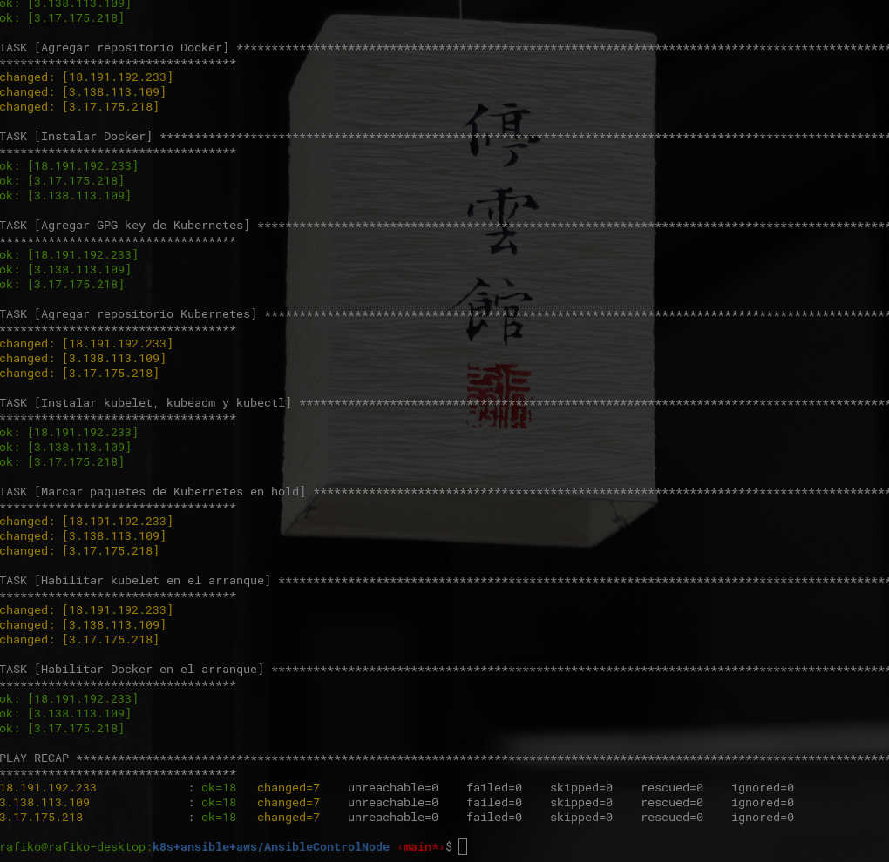

# Ansible Control Node
Este proyecto permite usar Ansible desde tu máquina designada desde donde se lanza el playbook que automatiza instancias Debian (hosts gestionados) en AWS con los siguientes paquetes:

- Docker
- kubeadm
- kubelet
- kubectl
- swap disabled

---

## Requisitos previos

- Instancias EC2 corriendo Debian.
- Acceso SSH mediante archivo `.pem` (keypair de AWS).
- Ansible instalado en tu máquina local.

---

### Instalacion Ansible

En una máquina con Debian/Ubuntu:

```bash
sudo apt update && sudo apt install ansible -y

```

### Estructura
```
	.
	├── inventory.ini # Define los nodos gestionados sobre los que Ansible va a ejecutar tareas.
	├── setup-k8s.yml # Playbook las tareas que ansible usa para automatizar la instalación de k8s.
	└── README.md # Documentacion
```

### Ejecutación del playbook

```bash
ansible-playbook -i inventory.ini setup-k8s.yml

```

---

¡Ansible listo para automatizar!


